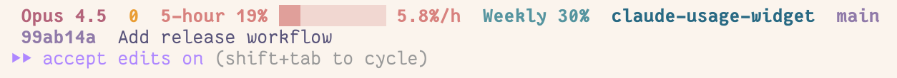

# Claude Usage Widget

A Go-based CLI tool for monitoring Claude AI usage with progress bars, burn rate predictions, and customizable display formats.



*The CLI widget executed by ccstatusline with two separate widgets. Colors are applied by ccstatusline mechanisms.*

## Features

- **Real-time Usage Monitoring**: Fetch current usage from Claude AI API
- **Multiple Session Types**: Support for 5-hour and weekly usage windows
- **Visual Progress Bars**: Unicode-based progress bars (░/▓) showing usage percentage
- **Burn Rate Predictions**: Calculate when you'll hit usage limits based on current consumption
- **Time Remaining Display**: Shows hours/minutes until reset
- **Caching**: Configurable caching to reduce API calls and improve performance
- **Customizable Output**: Template-based formatting for flexible display options
- **Configuration Management**: JSON config files with environment variable overrides
- **Verbose Logging**: Debug and verbose modes for troubleshooting

## Installation

### Option 1: Download Pre-built Binary

Download the latest release from the [releases page](https://github.com/alexesprit/claude-usage-widget/releases).

### Option 2: Build from Source

```bash
git clone https://github.com/alexesprit/claude-usage-widget.git
cd claude-usage-widget
go build -o usage .
```

### Option 3: Install with Go

```bash
go install github.com/alexesprit/claude-usage-widget@latest
```

## Configuration

The tool requires authentication credentials to access the Claude API. Configure these using either:

### Method 1: Environment Variables (Recommended)

```bash
export CLAUDE_CODE_USAGE_SESSION_KEY="your_session_key_here"
export CLAUDE_CODE_USAGE_ORGANIZATION_ID="your_org_id_here"
```

### Method 2: JSON Configuration File

The tool will automatically create a default configuration file on first run. To see the exact path where the config file will be created:

```bash
./usage --config
```

You can also manually create or edit the config file at the shown location. Example configuration:

```json
{
  "session_key": "your_session_key_here",
  "organization_id": "your_org_id_here",
  "cache_expiry_seconds": 60,
  "debug": false,
  "verbose": false,
  "sessions": [
    {
      "key": "five_hour",
      "name": "5-hour",
      "format": {
        "template": "{name}: {percent}% {progress} {time} {burn}"
      }
    },
    {
      "key": "seven_day",
      "name": "Weekly",
      "format": {
        "template": "{name}: {percent}% {progress} {time}"
      }
    }
  ]
}
```

### Configuration Options

| Option | Environment Variable | Default | Description |
|--------|---------------------|---------|-------------|
| `session_key` | `CLAUDE_CODE_USAGE_SESSION_KEY` | Required | Claude API session key |
| `organization_id` | `CLAUDE_CODE_USAGE_ORGANIZATION_ID` | Required | Claude organization ID |
| `cache_expiry_seconds` | `CLAUDE_CODE_USAGE_CACHE_EXPIRY_SECONDS` | 60 | Cache validity in seconds |
| `verbose` | `CLAUDE_CODE_USAGE_VERBOSE` | false | Enable verbose output |
| `debug` | `CLAUDE_CODE_USAGE_DEBUG` | false | Enable debug logging |
| `config_file` | `CLAUDE_CODE_USAGE_CONFIG_FILE` | Auto-detected | Path to config file |
| `cache_file` | `CLAUDE_CODE_USAGE_CACHE_FILE` | Auto-detected | Path to cache file |

### Obtaining Credentials

To get the required `session_key` and `organization_id`, you'll need to extract them from your Claude AI web session. Follow these steps:

#### Step 1: Log into Claude AI

1. Open [claude.ai](https://claude.ai) in your web browser
2. Log in to your Claude AI account if you haven't already

#### Step 2: Open Developer Tools

- **Chrome/Edge**: Press `F12` or `Ctrl+Shift+I` (Windows/Linux) / `Cmd+Option+I` (macOS)
- **Firefox**: Press `F12` or `Ctrl+Shift+I` (Windows/Linux) / `Cmd+Option+I` (macOS)
- **Safari**: Enable the Developer menu in Safari Preferences → Advanced, then press `Cmd+Option+I`

#### Step 3: Extract Session Key

1. In Developer Tools, go to the **Application** tab (Chrome/Edge) or **Storage** tab (Firefox)
2. In the left sidebar, expand **Cookies** and select `https://claude.ai`
3. Find the cookie named `sessionKey`
4. Copy the **Value** field (it should start with `sk-ant-sid01-...`)

This is your `session_key`.

#### Step 4: Get Organization ID

1. Navigate to your [account settings page](https://claude.ai/settings/account)
2. Your organization ID will be displayed on this page
3. Copy the organization ID value

#### Step 5: Configure the Tool

Once you have both values, set them using environment variables:

```bash
export CLAUDE_CODE_USAGE_SESSION_KEY="sk-ant-sid01-..."
export CLAUDE_CODE_USAGE_ORGANIZATION_ID="your_org_id_here"
```

Or add them to your JSON configuration file.

## Usage

### Basic Usage

Display 5-hour session usage:
```bash
./usage --5h
```

Display weekly session usage:
```bash
./usage --weekly
```

### Command Line Flags

| Flag | Short | Description |
|------|-------|-------------|
| `--5h` | | Display 5-hour session usage |
| `--weekly` | | Display weekly session usage |
| `--config` | `-c` | Show configuration file path |
| `--verbose` | `-v` | Enable verbose output |

### Example Output

```bash
# Normal mode: Shows sustainable consumption rate
5-hour: 75% ▓▓▓▓▓▓▓░░░ 2h 30m left (4.5%/h)

# Alert mode: Shows ETA when you'll hit limit before session ends  
5-hour: 75% ▓▓▓▓▓▓▓░░░ 2h 30m left (hit in 1h 15m)

# Weekly usage output can be configured separately
Weekly: 25% ▓▓░░░░░░░░ 2.3%/d
```

### Output Format Templates

The output format is controlled by templates with placeholders:

- `{name}`: Session name (e.g., "5-hour", "Weekly")
- `{percent}`: Usage percentage (e.g., "75%")
- `{progress}`: Progress bar (e.g., "▓▓▓▓▓▓▓░░░")
- `{time}`: Time remaining (e.g., "2h 30m left")
- `{burn}`: Burn rate prediction (e.g., "hit in 1h 15m")

### Burn Rate Predictions

The tool calculates burn rate predictions with smart format switching:

- **Smart ETA Mode**: When your current burn rate would hit the 100% limit before the current session window expires, it displays "hit in Xh Ym" (e.g., "hit in 1h 15m")
- **Normal Burn Rate**: When your usage is sustainable within the current window, it shows the hourly/daily consumption rate (e.g., "4.5%/h" for 5-hour sessions, "2.3%/d" for weekly sessions)

This smart switching helps you quickly identify when you need to slow down vs. when your usage is within normal limits.

## Status Bar Integration

The app is intended to use with ccstatusline or another Claude Code statusbar that allows executing custom commands.

### Using with ccstatusline

To use it with ccstatusline, you should add a custom command and specify "claude-usage-widget" or full path to binary. Don't forget to set larger timeout (by default ccstatusline has 1000ms timeout for custom command, which may not be enough for API calls).

### Custom Statusline Example

Here's a simple example of custom statusline for Claude Code implemented as bash script:

```bash
#!/bin/bash
# Custom statusline script for Claude Code
# Save this as ~/bin/claude-statusline.sh and make it executable

# Path to claude-usage-widget binary
USAGE_WIDGET="${USAGE_WIDGET:-claude-usage-widget}"

# Run usage widget with 5-hour session, capture output
if command -v "$USAGE_WIDGET" >/dev/null 2>&1; then
    "$USAGE_WIDGET" --5h 2>/dev/null || echo "Usage: API error"
else
    echo "Usage: widget not found"
fi
```

## Development

### Prerequisites

- Go 1.25.6 or later
- Access to Claude API (session key and organization ID)

### Building

```bash
make build          # Optimized build
make dev           # Development build
make release       # Optimized release build
```

### Testing

Run the full test suite:
```bash
make test
```

## Troubleshooting

### Common Issues

1. **"session key is required"**
   - Set `CLAUDE_CODE_USAGE_SESSION_KEY` environment variable
   - Or add to config.json

2. **"organization ID is required"**
   - Set `CLAUDE_CODE_USAGE_ORGANIZATION_ID` environment variable
   - Or add to config.json

3. **API errors**
   - Check session key validity
   - Verify organization ID
   - Check network connectivity

4. **Permission denied**
   - Ensure config directory is writable: `~/.config/claude-usage-widget/`
   - Ensure cache directory is writable: `~/.cache/claude-usage-widget/`

### Debug Mode

Enable debug logging:
```bash
export CLAUDE_CODE_USAGE_DEBUG=true
./usage --verbose --5h
```

## Contributing

1. Fork the repository
2. Create a feature branch: `git checkout -b feature/your-feature`
3. Write tests for new functionality
4. Ensure all tests pass: `go test ./...`
5. Submit a pull request

## Acknowledgments

This project was inspired by [hamed-elfayome/Claude-Usage-Tracker](https://github.com/hamed-elfayome/Claude-Usage-Tracker), a native macOS menu bar app for tracking Claude AI usage limits in real-time.

## License

This project is licensed under the MIT License - see the LICENSE file for details.

## Dependencies

- [github.com/bogdanfinn/fhttp](https://github.com/bogdanfinn/fhttp) - HTTP client with TLS fingerprinting
- [github.com/bogdanfinn/tls-client](https://github.com/bogdanfinn/tls-client) - TLS client library
- [github.com/knadh/koanf](https://github.com/knadh/koanf) - Configuration management
- Standard Go libraries (encoding/json, net/http, etc.)
